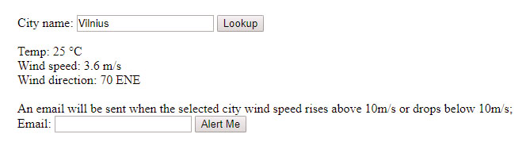

## Weather Watcher


An application for monitoring weather conditions. 
   * View real-time weather information on your selected city;
   * Get e-mail alerts about sudden changes (not yet implemented);
   
Weather Watcher uses OpenWeatherMap API to get weather information about cities and to set
weather alerts using native trigger functionality. If a certain weather condition is met - you get notified by email.

## Setup
Clone the repository and run:
```
composer install
```
Now configre your database credentials and your OpenWeatherMap API credentials in the .env file;
Then run:
```
php artisan migrate:fresh
```
Now just fire up your prefered php web server and you should be all set.

## License
MIT
   
 
 
   
